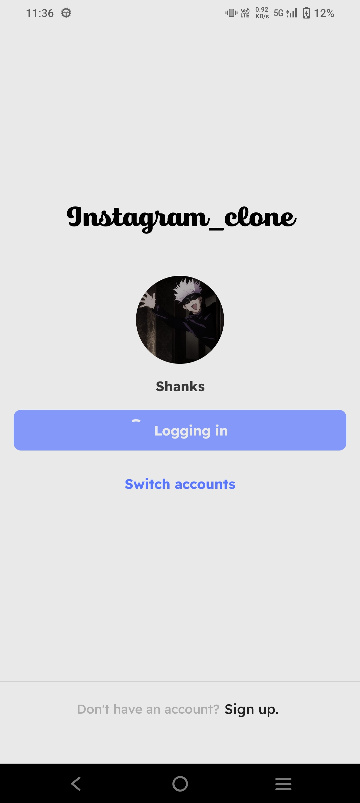
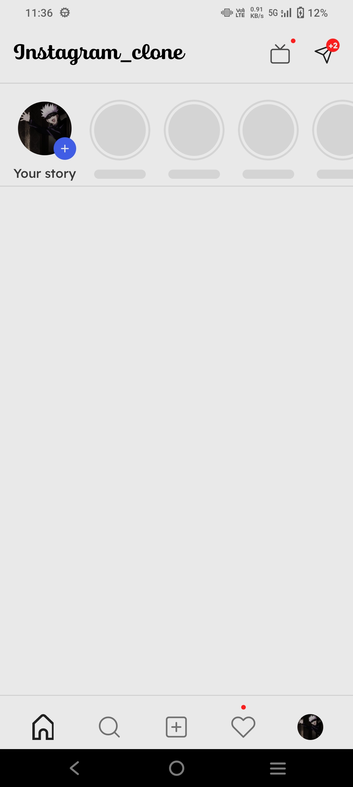
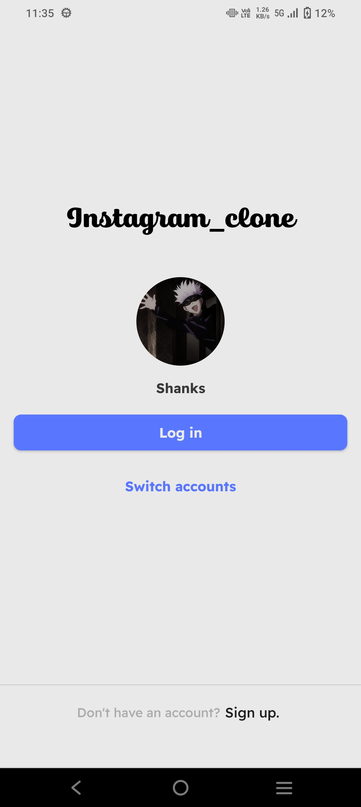
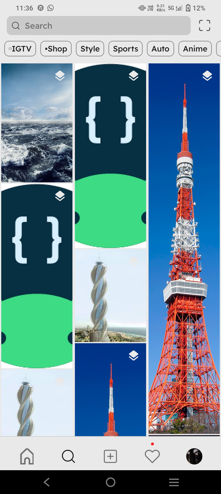

# Instagram Clone UI

This project is an Instagram clone UI built using Kotlin, Jetpack Compose, MVVM architecture, Dagger Hilt, Timber, and Android Studio. It was developed during the Jetpack Compose Camp in my college, where I served as the Kotlin facilitator.

## Features

- Instagram-like user interface
- 3 Screens built
- shimmering effects
- Utilizes Jetpack Compose for building the UI
- Follows MVVM architecture for separation of concerns
- Dependency injection with Dagger Hilt for managing dependencies
- Logging with Timber for better debugging experience

## Technologies Used

- Kotlin
- Jetpack Compose
- MVVM architecture
- Dagger Hilt
- Timber
- Android Studio

## Screenshots

| Screenshot 1 | Screenshot 2 |
|--------------|--------------|
|  |  |

| Screenshot 3 | Screenshot 4 |
|--------------|--------------|
|  |  |

| Screenshot 5 | Screenshot 6 |
|--------------|--------------|
|  |  |

## Contributing

Contributions to this project are welcome. If you would like to contribute, please follow these steps:

1. Fork the repository.

2. Create a new branch for your feature or bug fix.

3. Make your changes and commit them with descriptive commit messages.

4. Push your changes to your forked repository.

5. Submit a pull request to the main repository.
